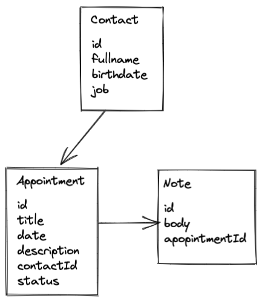
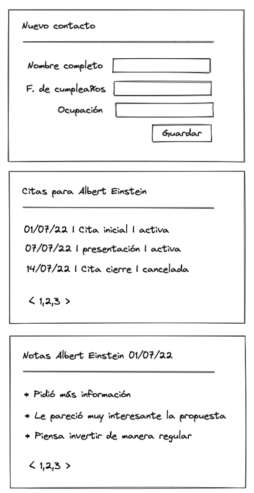

# AsistenteInteligente: Aplicación Web para cartera de clientes

## Descripción

AsistenteInteligente es una aplicación que permite a un usuario llevar el registro de sus contactos y las citas que tiene con ellos, además permite añadir notas a cada cita.

## Diagrama



## Mockups (propuesta)



### Entidades de dominio
Las entidades consideradas para la fase de MVP son:

* Contact
* Appointment
* Note

### Mutations:

#### Contactos

El usuario puede crear un contacto

```
POST /contacts
```

El usuario puede eliminar un contacto

```
DELETE /contacts/:id
```

#### Citas

El usuario puede crear una cita relacionada a un contacto

```
POST /contacts/:id/appointments
```

El usuario puede marcar como cancelada una cita

```
PATCH /contacts/:id/appointments
```

El usuario puede eliminar una cita

```
DELETE /appointments/:id
```

#### Notas

El usuario puede crear una nota relacionada a una cita

```
POST /appointments/:id/notes
```

El usuario puede eliminar la nota de una cita

```
DELETE /appointments/:appointment_id/notes/:id
```

### Queries:

#### Contactos

El usuario puede obtener las citas de un contacto

```
GET /contacts/:id/appointments
```

El usuario puede consultar todos los contactos en su cartera

```
GET /contacts
```
El usuario puede obtener los datos de un sólo contacto

```
GET /contacts/id
```

#### Citas
El usuario puede consultar los detalles de un contacto a través de una cita

```
GET /appointments/:id/contact
```

El usuario puede consultar los detalles de una cita

```
GET /appointments/:id
```
El usuario puede consultar todas sus citas activas

```
GET /appointments
```

#### Notas

El usuario puede consultar el detalle de una cita a través de una nota

```
GET /notes/:id/appointment
```

El usuario puede consultar todas las notas que han sido creadas para una cita

```
GET /appointments/:id/notes
```
